# Team Beverage End of Year Perfromance Project SQL --> Tableau

###### By: Steven Nguyen

## Introduction

#### In this project I will use MySQL to explore and analyze data and then visualize the data in Tableau to provide insights to the stakeholders.

## Objective
###### (*Please note that the names in the project are fictitious and are used only for the purpose of this project & the dataset is a mock dataset*)
##### I am a manager in sales covering NYC for a beverage company. Since it is the end of the year I am tasked with evaluating my teams performance this year and presenting it in a final Tableau story. The stakeholders need to know which employees hitting their metrics or not achieving their metrics. If not they need to know how will I improve their performance for the coming year. They need to also know which employees deserves a full merit increase and which employee is ready for a promotion. They also what KPI directly affect cases sold as it drives profit. They will need data driven insights from me. To deliver data driven insights to my stakeholder I will answer questions like:
	1. Which rep is performing the best or worst?
	2. Is there a correlation between # of account visits and cases sold?
	3. How do we improve the performance of the worst performing rep
	4. Is there any trends that is seen in the database?
	5. How do we makes sure we sell more cases for next year?

## Stakeholders

    [] Kim Tran- V.P. of Sales
    [] John David- Director of Sales


#### Before analyzing data

#### I will examine the table to look for anything to fix/clean before I do my analysis.
```
SELECT * FROM reps;
```

####  Renaming columns total_cases_sold & total cases to avoid confusion between two columns.
```
ALTER TABLE reps
RENAME COLUMN total_cases_sold TO cases_sold_$;

ALTER TABLE reps
RENAME COLUMN `total cases` TO cases_sold;
```

#### Check if columns have been changed.
```
SELECT * FROM reps;
```
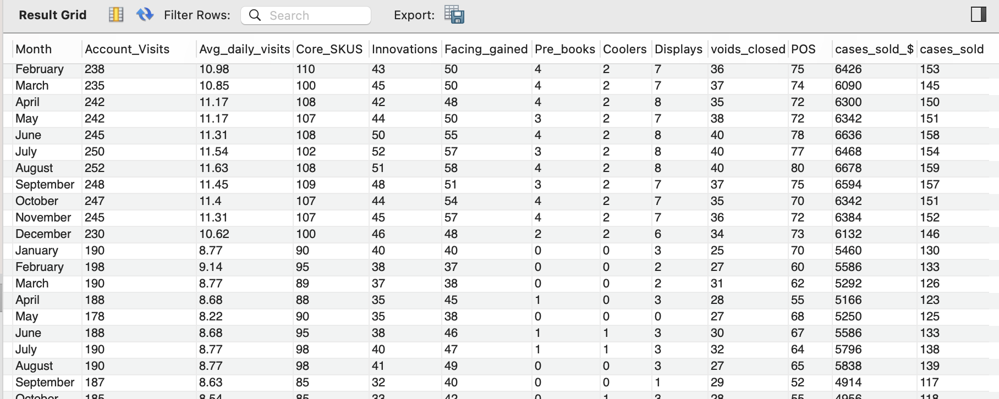<!-- -->

####  Finding the name of the sales rep, region covered and name of the manager
```
SELECT distinct CONCAT(city,', ',state) as team_region,
      manager,employee_id,
      CONCAT(first_name,' ',last_name) as full_name,
      borough as region_covered
FROM reps;
```
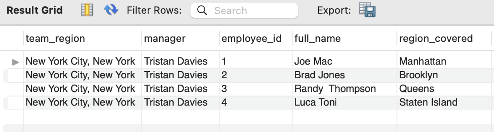<!-- -->

### STEPS

#### 1. Finding the total amount of accounts visited for all sales reps ordered by the sale rep with the most visits.
```
SELECT first_name,last_name,year,borough as region_covered,
       SUM(account_visits) as total_visits
FROM reps
GROUP BY 1,2,3,4
ORDER BY 5 DESC;
```
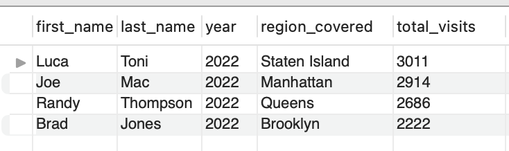<!-- -->
#### 2. Finding the total # of cases sold and # of cases sold by each sales rep.
```
SELECT first_name,last_name,year,borough as region_covered,
       SUM(cases_sold_$) as total_cases_sold_$, SUM(cases_sold) as num_of_cases
FROM reps
GROUP BY 1,2,3,4
ORDER BY 5 DESC;
```
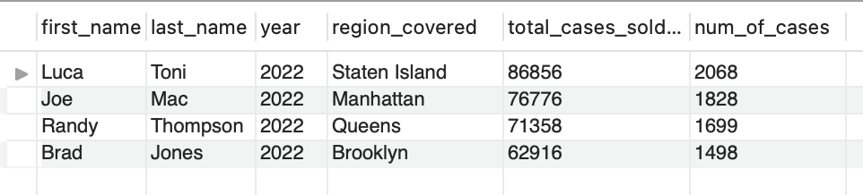<!-- -->
#### 3. Finding the average of cases sold and # of cases sold by each sales rep.
```
SELECT first_name,last_name,year,borough as region_covered,
       ROUND(AVG(cases_sold_$),0) as total_cases_sold_$,
        ROUND(AVG(cases_sold),2) as num_of_cases
FROM reps
GROUP BY 1,2,3,4
ORDER BY 5 DESC;
```
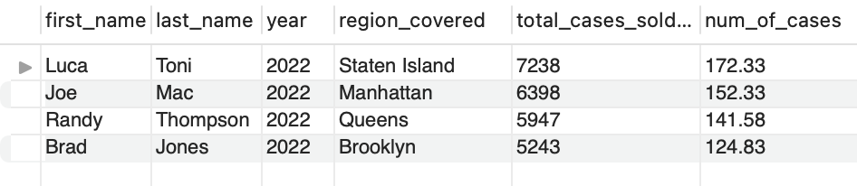<!-- -->
#### 4. Finding the average daily visits by each sales rep.
```
SELECT first_name,last_name,borough as region_covered,
       ROUND(AVG(avg_daily_visits),2) as average_daily_visits
FROM reps
GROUP BY 1,2,3
ORDER BY 4 DESC;
```
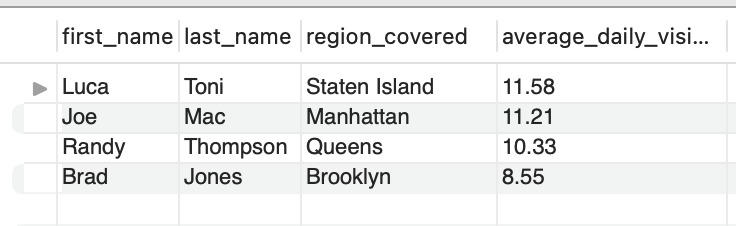<!-- -->
#### 5. Seeing if there is a correlation between account visits and cases sold.
```
SELECT first_name,last_name,borough as region_covered,month,
       account_visits,avg_daily_visits,cases_sold_$,cases_sold
FROM reps
WHERE month IN('June','July','August')
ORDER BY 7 DESC;
```
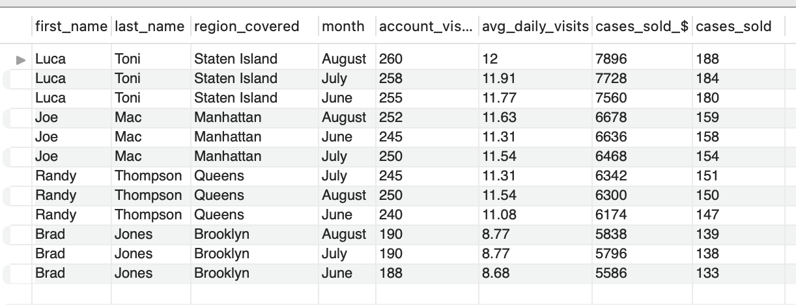<!-- -->

#### 6. Examining the best sales rep compared to the worst performing sales rep by monthly performance.
```
SELECT first_name,last_name,account_visits, avg_daily_visits,
       month,cases_sold_$, cases_sold
FROM reps
WHERE first_name IN('Luca','Brad')
ORDER BY 7 DESC
```
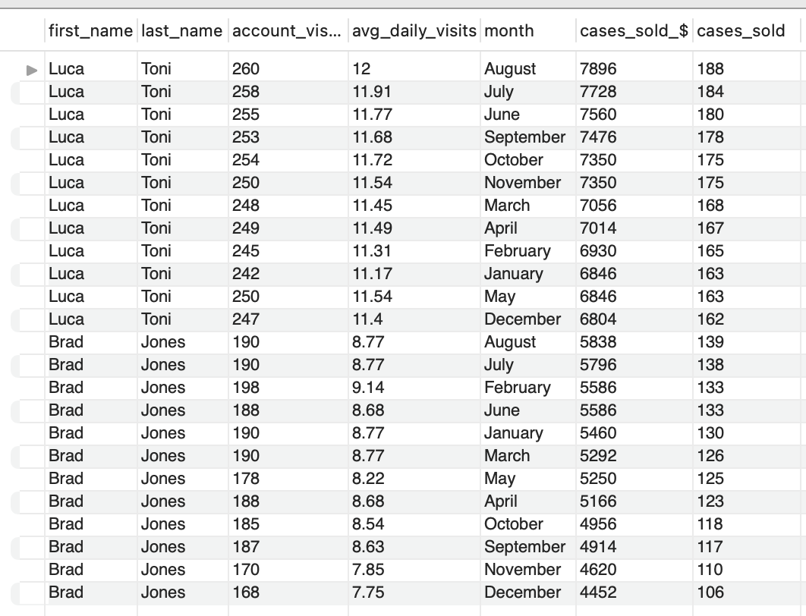<!-- -->
#### 7. Finding the top 5 worst selling months.
```
SELECT month,SUM(account_visits) as total_account_visits,
       SUM(cases_sold_$) as total_cases_$,SUM(cases_sold) as total_cases_sold
FROM reps
GROUP BY 1
ORDER BY 3 ASC
LIMIT 5;
```
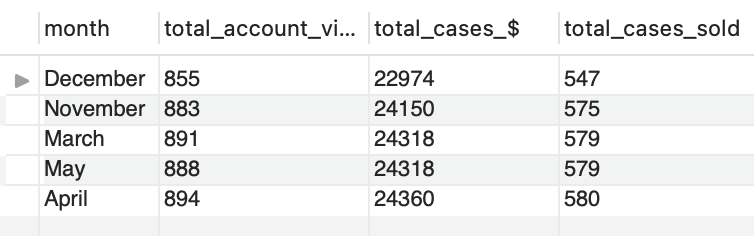<!-- -->
#### 8. Finding the top 5 selling months.
```
SELECT month,SUM(account_visits) as total_account_visits,
       SUM(cases_sold_$) as total_cases_$,SUM(cases_sold) as total_cases_sold
FROM reps
GROUP BY 1
ORDER BY 3 DESC
LIMIT 5;
```
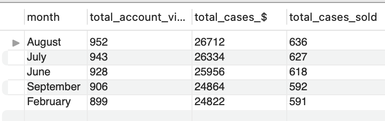<!-- -->
#### 9. Comparing Core Skus and Innovations cases sold.
```
SELECT first_name,last_name,borough as region_covered,
       SUM(core_skus) as total_skus,SUM(innovations) as total_innovations
FROM reps
GROUP BY 1,2,3
ORDER BY 4 DESC;
```
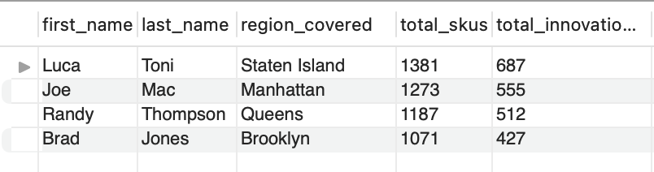<!-- -->
#### 10. Seeing if placing POS and Coolers has a correlation in the # of cases sold for the year.
```
SELECT first_name,last_name,borough as region_covered, SUM(POS) as total_POS,
       SUM(coolers) as total_coolers,SUM(cases_sold_$) as total_cases_$,SUM(cases_sold) as total_cases_sold
FROM reps
GROUP BY 1,2,3
ORDER BY 7 DESC;
```
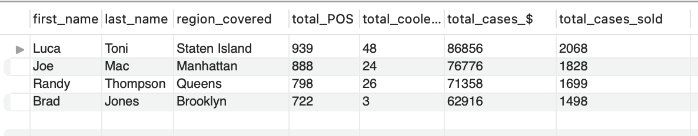<!-- -->
#### 11. Finding the average weekly visits per sales rep.
```
SELECT first_name,last_name,borough as region_covered, 
       ROUND(SUM(Account_Visits)/52,2) as average_weekly
FROM reps
GROUP BY 1,2,3
ORDER BY 4 DESC;
```
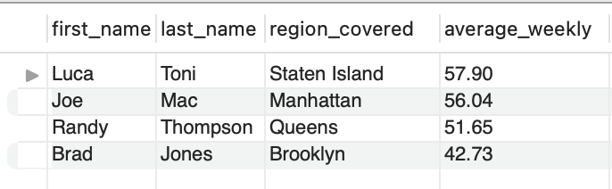<!-- -->
#### 12. Finding the teams monthly visits by month and correlation if any with cases sold.
```
SELECT  month,SUM(cases_sold) as total_cases_sold,
       ROUND(SUM(Account_Visits),2) as team_month_visits
FROM reps
GROUP BY 1
ORDER BY 2 DESC;
```
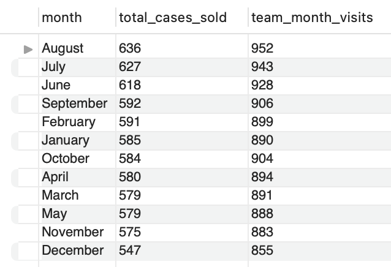<!-- -->
#### 13. Seeing if there is a correlation between facings gained in the cold vault and # of cases sold.
```
SELECT first_name,last_name,borough as region_covered, SUM(facing_gained) as total_facings,
       SUM(cases_sold_$) as total_cases_$,SUM(cases_sold) as total_cases_sold
FROM reps
GROUP BY 1,2,3
ORDER BY 6 DESC;
```
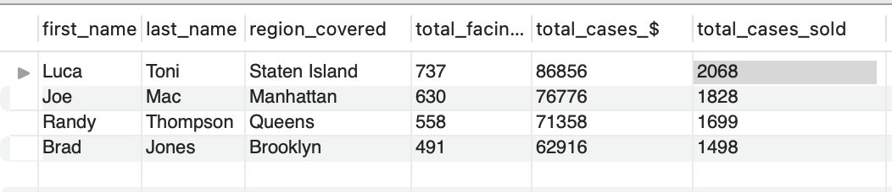<!-- -->

###### *Now the data is ready to be visualized in Tableau*

## [Link to Tableau Dashboard](https://public.tableau.com/views/Beverage_team/Dashboard1?:language=en-US&:display_count=n&:origin=viz_share_link)

## Final Insights
1. The team sold a total of 7093 cases resulting in $297.91 k ins sales and visited 10,833 accounts
2. The team averaged 10.42 daily stops a day.
3. There is a direct correlation between account visits and cases sold
4. Luca Toni of Staten Island is the best sales rep with an average daily stop of 11.58 and Brad Jones of Brooklyn is the worst performing rep with an average of 8.55 stops a day.
5. Joe Mac of Manhattan is our 2nd best sales rep with average daily stop of 11.21 and Randy Thompson of Queens is the 3rd best performing rep with an average of 10.33 stops a day.
6. Luca Toni sold the most cases with 2068 sold resulting in $86.86k, Joe Mac sold the 2nd most selling 1828 cases resulting in $76.78k in sales, followed by Randy Thompson sold 1699 cases resulting in $71.36 k in sales,Brad Jones sold the least selling only 1498 cases resulting in $62.92 k in sales.
7. Luca Toni deserves a full merit increase and he is ready for a promotion.
8. Both Luca & Joe are surpassing their goals thus deserving the full merit increase. With Randy meeting his goals he deserves the normal merit increase and Brad doesn't merit an increase as he failed to meet his goals.
10. Doing a deeper dive into into Randy monthly numbers it seems that he is motivated to just met his targets and nothing more as his numbers month to month are more of the same. This suggests that he is not performing to his potential. I will schedule a meeting with him to discuss.
11. I need to be out in the field with Brad for further training as he is not meeting any of our KPIs
12. Have worst performing sales rep Brad do a route ride with Luca Toni so he can learn from our best sales rep.
13. June, July, August are the busiest months while the winter/holidays months are the slowest 
14. There is a direct correlation between facing gained, POS, coolers placed and # of cases sold. To increase this KPIs I suggest that we have an incentive or make it apart of their bonuses.
15. 1/3 of our sales were innovations which means that 30% of our sales were new flavors!
