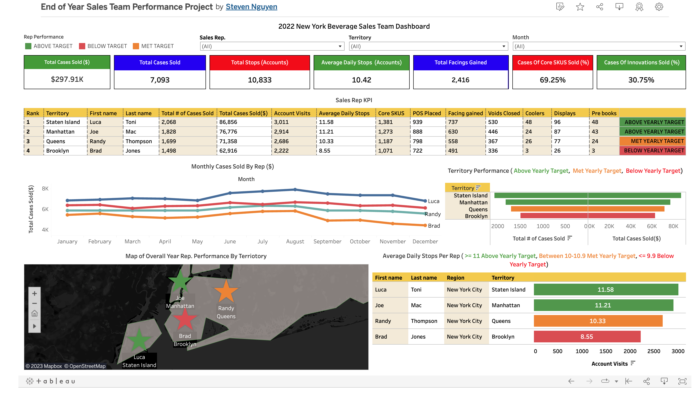

# Team Beverage End of Year Perfromance Project SQL --> Tableau

###### By: Steven Nguyen

## Introduction

In this project I will use MySQL to explore and analyze data and then visualize the data in Tableau to provide insights to the stakeholders.

## Objective
###### (*Please note that the names in the project are fictitious and are used only for the purpose of this project & the dataset is a mock dataset*)
I am a sales manager responsible for overseeing the NYC region for a beverage company. As the year comes to a close, I have been assigned the task of evaluating my team's performance throughout the year and presenting my insights to senior leadership. The stakeholders require information on which employees have met their performance metrics and those who haven't. For those who didn't meet their metrics, I will outline strategies to improve their performance in the coming year. Additionally, the stakeholders want to identify employees deserving of a full merit increase and those ready for a promotion. Furthermore, they seek to understand which Key Performance Indicators (KPIs) directly impact the number of cases sold, as it directly affects the company's profitability. To meet these requirements, I will provide data-driven insights by addressing questions such as:
	
 	1. Which rep is performing the best or worst?
	2. Is there a correlation between # of account visits and cases sold?
	3. How do we improve the performance of the worst performing rep
	4. Is there any trends that is seen in the database?
	5. How do we makes sure we sell more cases for next year?

## Stakeholders

    [] Kim Tran- V.P. of Sales
    [] John David- Director of Sales


#### Before analyzing data

#### I will examine the table to look for anything to fix/clean before I do my analysis.
```
SELECT * FROM reps;
```

####  Renaming columns total_cases_sold & total cases to avoid confusion between two columns.
```
ALTER TABLE reps
RENAME COLUMN total_cases_sold TO cases_sold_$;

ALTER TABLE reps
RENAME COLUMN `total cases` TO cases_sold;
```

#### Check if columns have been changed.
```
SELECT * FROM reps;
```
<!-- -->

####  Finding the name of the sales rep, region covered and name of the manager
```
SELECT distinct CONCAT(city,', ',state) as team_region,
      manager,employee_id,
      CONCAT(first_name,' ',last_name) as full_name,
      borough as region_covered
FROM reps;
```
<!-- -->

### STEPS

#### 1. Finding the total amount of accounts visited for all sales reps ordered by the sale rep with the most visits.
```
SELECT first_name,last_name,year,borough as region_covered,
       SUM(account_visits) as total_visits
FROM reps
GROUP BY 1,2,3,4
ORDER BY 5 DESC;
```
<!-- -->
#### 2. Finding the total # of cases sold and # of cases sold by each sales rep.
```
SELECT first_name,last_name,year,borough as region_covered,
       SUM(cases_sold_$) as total_cases_sold_$, SUM(cases_sold) as num_of_cases
FROM reps
GROUP BY 1,2,3,4
ORDER BY 5 DESC;
```
<!-- -->
#### 3. Finding the average of cases sold and # of cases sold by each sales rep.
```
SELECT first_name,last_name,year,borough as region_covered,
       ROUND(AVG(cases_sold_$),0) as total_cases_sold_$,
        ROUND(AVG(cases_sold),2) as num_of_cases
FROM reps
GROUP BY 1,2,3,4
ORDER BY 5 DESC;
```
<!-- -->
#### 4. Finding the average daily visits by each sales rep.
```
SELECT first_name,last_name,borough as region_covered,
       ROUND(AVG(avg_daily_visits),2) as average_daily_visits
FROM reps
GROUP BY 1,2,3
ORDER BY 4 DESC;
```
<!-- -->
#### 5. Seeing if there is a correlation between account visits and cases sold.
```
SELECT first_name,last_name,borough as region_covered,month,
       account_visits,avg_daily_visits,cases_sold_$,cases_sold
FROM reps
WHERE month IN('June','July','August')
ORDER BY 7 DESC;
```
<!-- -->

#### 6. Examining the best sales rep compared to the worst performing sales rep by monthly performance.
```
SELECT first_name,last_name,account_visits, avg_daily_visits,
       month,cases_sold_$, cases_sold
FROM reps
WHERE first_name IN('Luca','Brad')
ORDER BY 7 DESC
```
<!-- -->
#### 7. Finding the top 5 worst selling months.
```
SELECT month,SUM(account_visits) as total_account_visits,
       SUM(cases_sold_$) as total_cases_$,SUM(cases_sold) as total_cases_sold
FROM reps
GROUP BY 1
ORDER BY 3 ASC
LIMIT 5;
```
<!-- -->
#### 8. Finding the top 5 selling months.
```
SELECT month,SUM(account_visits) as total_account_visits,
       SUM(cases_sold_$) as total_cases_$,SUM(cases_sold) as total_cases_sold
FROM reps
GROUP BY 1
ORDER BY 3 DESC
LIMIT 5;
```
<!-- -->
#### 9. Comparing Core Skus and Innovations cases sold.
```
SELECT first_name,last_name,borough as region_covered,
       SUM(core_skus) as total_skus,SUM(innovations) as total_innovations
FROM reps
GROUP BY 1,2,3
ORDER BY 4 DESC;
```
<!-- -->
#### 10. Seeing if placing POS and Coolers has a correlation in the # of cases sold for the year.
```
SELECT first_name,last_name,borough as region_covered, SUM(POS) as total_POS,
       SUM(coolers) as total_coolers,SUM(cases_sold_$) as total_cases_$,SUM(cases_sold) as total_cases_sold
FROM reps
GROUP BY 1,2,3
ORDER BY 7 DESC;
```
<!-- -->
#### 11. Finding the average weekly visits per sales rep.
```
SELECT first_name,last_name,borough as region_covered, 
       ROUND(SUM(Account_Visits)/52,2) as average_weekly
FROM reps
GROUP BY 1,2,3
ORDER BY 4 DESC;
```
<!-- -->
#### 12. Finding the teams monthly visits by month and correlation if any with cases sold.
```
SELECT  month,SUM(cases_sold) as total_cases_sold,
       ROUND(SUM(Account_Visits),2) as team_month_visits
FROM reps
GROUP BY 1
ORDER BY 2 DESC;
```
<!-- -->
#### 13. Seeing if there is a correlation between facings gained in the cold vault and # of cases sold.
```
SELECT first_name,last_name,borough as region_covered, SUM(facing_gained) as total_facings,
       SUM(cases_sold_$) as total_cases_$,SUM(cases_sold) as total_cases_sold
FROM reps
GROUP BY 1,2,3
ORDER BY 6 DESC;
```
<!-- -->

###### *Now the data is ready to be visualized in Tableau*

## [Link to Tableau Dashboard](https://public.tableau.com/views/Beverage_team/Dashboard1?:language=en-US&:display_count=n&:origin=viz_share_link)
<!-- -->

## Final Insights
* The team sold a total of 7,093 cases, resulting in $297.91k in sales, and visited 10,833 accounts.
* The team averaged 10.42 daily stops per day.
* There is a direct correlation between account visits and cases sold.
* Luca Toni of Staten Island is the best sales rep with an average of 11.58 daily stops, while Brad Jones of Brooklyn is the worst-performing rep with an average of 8.55 stops per day.
* Joe Mac of Manhattan is our second-best sales rep with an average of 11.21 daily stops, and Randy Thompson of Queens is the third-best performing rep with an average of 10.33 stops per day.
* Luca Toni sold the most cases, with 2,068 sold, resulting in $86.86k in sales. Joe Mac sold the second-most, with 1,828 cases, resulting in $76.78k in sales. Followed by Randy Thompson, who sold 1,699 cases, resulting in $71.36k in sales. Brad Jones sold the least, with only 1,498 cases, resulting in $62.92k in sales.
* Luca Toni deserves a full merit increase, and he is ready for a promotion.
* Both Luca and Joe are surpassing their goals, thus deserving the full merit increase. Randy, meeting his goals, deserves the normal merit increase, and Brad doesn't merit an increase as he failed to meet his goals.
* Upon analyzing Randy's monthly numbers, it seems that he is only motivated to meet his targets and nothing more, as his numbers month-to-month show a consistent pattern. This suggests that he is not performing up to his potential. I will schedule a meeting with him to discuss further.
* I need to accompany Brad in the field for additional training, as he is not meeting any of our metrics.
* To help improve the performance of our worst-performing sales rep, Brad, I suggest having him do a route ride with Luca Toni to learn from our best sales rep.
* June, July, and August are the busiest months, while the winter/holiday months are the slowest.
* There is a direct correlation between facings gained, POS placements, coolers placed, and the number of cases sold. To increase these metrics, I suggest implementing incentives or making them a part of their bonuses.
* Approximately one-third of our sales were innovations, indicating that 30% of our sales were from new flavors!
